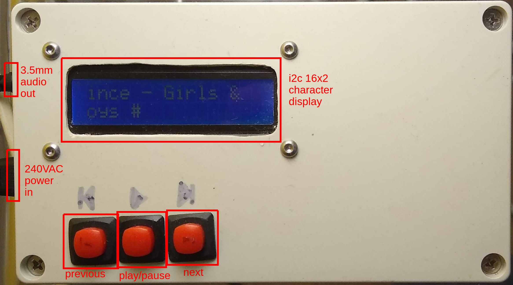

# (Yet Another) Raspberry Pi Music Player



A minimalist way to play music using:
* [Raspberry Pi Zero Wireless](https://www.raspberrypi.org/products/raspberry-pi-zero-w/) (£10 off ThePiHut)
* [mpd - Music Player Daemon](https://www.musicpd.org/)
* [mpc - Music Player Client](https://www.musicpd.org/clients/mpc/)
* i2c 16x2 character LCD display (£5 off eBay)
* USB sound card (£1 off eBay)
* USB storage key

## Featuring
* three buttons:
 * play/pause (stop/start music)
 * next (if you don't like current song)
 * previous (if you like song and want to hear it again)
* display to show currently playing song
* randomised playlist of your songs

## Description
### Hardware
A _Raspberry Pi Zero Wireless (RPi0W)_ is used with a _USB soundcard_ to provide a 3.5mm audio jack output.
Music is stored on a _USB key_ attached to the _RPi0W_.

### Software
_mpd_ is run as a system service, with _mpc_ providing the interface to control the music.
Two python scripts are run at system startup.

## Scripts
Two scripts are run on system startup from:

``/etc/rc.local``

<details>

````bash
#!/bin/sh -e
#
# rc.local
#
# This script is executed at the end of each multiuser runlevel.
# Make sure that the script will "exit 0" on success or any other
# value on error.
#
# In order to enable or disable this script just change the execution
# bits.
#
# By default this script does nothing.

# Print the IP address
_IP=$(hostname -I) || true
if [ "$_IP" ]; then
  printf "My IP address is %s\n" "$_IP"
fi

sudo /home/trevorde/mpd-ui/MusicMonitor.py &
sudo /home/trevorde/mpd-ui/WhatsPlaying.py &

exit 0
````

</details>
<br />

_MusicMonitor.py_ polls each of the three buttons and takes appropriate action

_WhatsPlaying.py_ polls for currently playing song and scrolls the information across the display

## Music Player Daemon Configuration
mpd is controlled by a config file at:

``/etc/mpd.conf``

<details>

````
# An example configuration file for MPD.
# Read the user manual for documentation: http://www.musicpd.org/doc/user/
# or /usr/share/doc/mpd/html/user.html


# Files and directories #######################################################
#
# This setting controls the top directory which MPD will search to discover the
# available audio files and add them to the daemon's online database. This
# setting defaults to the XDG directory, otherwise the music directory will be
# be disabled and audio files will only be accepted over ipc socket (using
# file:// protocol) or streaming files over an accepted protocol.
#
music_directory		"/media/bluebox/MP3/Music/"
#
# This setting sets the MPD internal playlist directory. The purpose of this
# directory is storage for playlists created by MPD. The server will use
# playlist files not created by the server but only if they are in the MPD
# format. This setting defaults to playlist saving being disabled.
#
playlist_directory		"/var/lib/mpd/playlists"
#
# This setting sets the location of the MPD database. This file is used to
# load the database at server start up and store the database while the
# server is not up. This setting defaults to disabled which will allow
# MPD to accept files over ipc socket (using file:// protocol) or streaming
# files over an accepted protocol.
#
db_file			"/var/lib/mpd/tag_cache"
#
# These settings are the locations for the daemon log files for the daemon.
# These logs are great for troubleshooting, depending on your log_level
# settings.
#
# The special value "syslog" makes MPD use the local syslog daemon. This
# setting defaults to logging to syslog, or to journal if mpd was started as
# a systemd service.
#
log_file			"/var/log/mpd/mpd.log"
#
# This setting sets the location of the file which stores the process ID
# for use of mpd --kill and some init scripts. This setting is disabled by
# default and the pid file will not be stored.
#
pid_file			"/run/mpd/pid"
#
# This setting sets the location of the file which contains information about
# most variables to get MPD back into the same general shape it was in before
# it was brought down. This setting is disabled by default and the server
# state will be reset on server start up.
#
state_file			"/var/lib/mpd/state"
#
# The location of the sticker database.  This is a database which
# manages dynamic information attached to songs.
#
sticker_file                   "/var/lib/mpd/sticker.sql"
#
###############################################################################


# General music daemon options ################################################
#
# This setting specifies the user that MPD will run as. MPD should never run as
# root and you may use this setting to make MPD change its user ID after
# initialization. This setting is disabled by default and MPD is run as the
# current user.
#
user				"mpd"
#
# This setting specifies the group that MPD will run as. If not specified
# primary group of user specified with "user" setting will be used (if set).
# This is useful if MPD needs to be a member of group such as "audio" to
# have permission to use sound card.
#
#group                          "nogroup"
#
# This setting sets the address for the daemon to listen on. Careful attention
# should be paid if this is assigned to anything other then the default, any.
# This setting can deny access to control of the daemon. Choose any if you want
# to have mpd listen on every address. Not effective if systemd socket
# activation is in use.
#
# For network
bind_to_address		"localhost"
#
# And for Unix Socket
#bind_to_address		"/run/mpd/socket"
#
# This setting is the TCP port that is desired for the daemon to get assigned
# to.
#
#port				"6600"
#
# This setting controls the type of information which is logged. Available
# setting arguments are "default", "secure" or "verbose". The "verbose" setting
# argument is recommended for troubleshooting, though can quickly stretch
# available resources on limited hardware storage.
#
#log_level			"default"
#
# Setting "restore_paused" to "yes" puts MPD into pause mode instead
# of starting playback after startup.
#
#restore_paused "no"
#
# This setting enables MPD to create playlists in a format usable by other
# music players.
#
#save_absolute_paths_in_playlists	"no"
#
# This setting defines a list of tag types that will be extracted during the
# audio file discovery process. The complete list of possible values can be
# found in the user manual.
#metadata_to_use	"artist,album,title,track,name,genre,date,composer,performer,disc"
#
# This example just enables the "comment" tag without disabling all
# the other supported tags:
#metadata_to_use "+comment"
#
# This setting enables automatic update of MPD's database when files in
# music_directory are changed.
#
#auto_update    "yes"
#
# Limit the depth of the directories being watched, 0 means only watch
# the music directory itself.  There is no limit by default.
#
#auto_update_depth "3"
#
###############################################################################


# Symbolic link behavior ######################################################
#
# If this setting is set to "yes", MPD will discover audio files by following
# symbolic links outside of the configured music_directory.
#
#follow_outside_symlinks	"yes"
#
# If this setting is set to "yes", MPD will discover audio files by following
# symbolic links inside of the configured music_directory.
#
#follow_inside_symlinks		"yes"
#
###############################################################################


# Zeroconf / Avahi Service Discovery ##########################################
#
# If this setting is set to "yes", service information will be published with
# Zeroconf / Avahi.
#
#zeroconf_enabled		"yes"
#
# The argument to this setting will be the Zeroconf / Avahi unique name for
# this MPD server on the network. %h will be replaced with the hostname.
#
#zeroconf_name			"Music Player @ %h"
#
###############################################################################


# Permissions #################################################################
#
# If this setting is set, MPD will require password authorization. The password
# setting can be specified multiple times for different password profiles.
#
#password                        "password@read,add,control,admin"
#
# This setting specifies the permissions a user has who has not yet logged in.
#
#default_permissions             "read,add,control,admin"
#
###############################################################################


# Database #######################################################################
#

#database {
#       plugin "proxy"
#       host "other.mpd.host"
#       port "6600"
#}

# Input #######################################################################
#

input {
        plugin "curl"
#       proxy "proxy.isp.com:8080"
#       proxy_user "user"
#       proxy_password "password"
}

# QOBUZ input plugin
input {
        enabled    "no"
        plugin     "qobuz"
#        app_id     "ID"
#        app_secret "SECRET"
#        username   "USERNAME"
#        password   "PASSWORD"
#        format_id  "N"
}

# TIDAL input plugin
input {
        enabled      "no"
        plugin       "tidal"
#        token        "TOKEN"
#        username     "USERNAME"
#        password     "PASSWORD"
#        audioquality "Q"
}

# Decoder #####################################################################
#

decoder {
        plugin                  "hybrid_dsd"
        enabled                 "no"
#       gapless                 "no"
}

#
###############################################################################

# Audio Output ################################################################
#
# MPD supports various audio output types, as well as playing through multiple
# audio outputs at the same time, through multiple audio_output settings
# blocks. Setting this block is optional, though the server will only attempt
# autodetection for one sound card.
#
# An example of an ALSA output:
#
audio_output {
	type		"alsa"
	name		"My ALSA Device"
#	device		"hw:0,0"	# optional
#	mixer_type      "hardware"      # optional
#	mixer_device	"default"	# optional
#	mixer_control	"PCM"		# optional
#	mixer_index	"0"		# optional
}
#
# An example of an OSS output:
#
#audio_output {
#	type		"oss"
#	name		"My OSS Device"
#	device		"/dev/dsp"	# optional
#	mixer_type      "hardware"      # optional
#	mixer_device	"/dev/mixer"	# optional
#	mixer_control	"PCM"		# optional
#}
#
# An example of a shout output (for streaming to Icecast):
#
#audio_output {
#	type		"shout"
#	encoder		"vorbis"		# optional
#	name		"My Shout Stream"
#	host		"localhost"
#	port		"8000"
#	mount		"/mpd.ogg"
#	password	"hackme"
#	quality		"5.0"
#	bitrate		"128"
#	format		"44100:16:1"
#	protocol	"icecast2"		# optional
#	user		"source"		# optional
#	description	"My Stream Description"	# optional
#	url             "http://example.com"    # optional
#	genre		"jazz"			# optional
#	public		"no"			# optional
#	timeout		"2"			# optional
#	mixer_type      "software"              # optional
#}
#
# An example of a recorder output:
#
#audio_output {
#       type            "recorder"
#       name            "My recorder"
#       encoder         "vorbis"                # optional, vorbis or lame
#       path            "/var/lib/mpd/recorder/mpd.ogg"
##      quality         "5.0"                   # do not define if bitrate is defined
#       bitrate         "128"                   # do not define if quality is defined
#       format          "44100:16:1"
#}
#
# An example of a httpd output (built-in HTTP streaming server):
#
#audio_output {
#	type		"httpd"
#	name		"My HTTP Stream"
#	encoder		"vorbis"		# optional, vorbis or lame
#	port		"8000"
#	bind_to_address "0.0.0.0"               # optional, IPv4 or IPv6
#	quality		"5.0"			# do not define if bitrate is defined
#	bitrate		"128"			# do not define if quality is defined
#	format		"44100:16:1"
#	max_clients     "0"                     # optional 0=no limit
#}
#
# An example of a pulseaudio output (streaming to a remote pulseaudio server)
# Please see README.Debian if you want mpd to play through the pulseaudio
# daemon started as part of your graphical desktop session!
#
#audio_output {
#	type		"pulse"
#	name		"My Pulse Output"
#	server		"remote_server"		# optional
#	sink		"remote_server_sink"	# optional
#}
#
# An example of a winmm output (Windows multimedia API).
#
#audio_output {
#	type		"winmm"
#	name		"My WinMM output"
#	device		"Digital Audio (S/PDIF) (High Definition Audio Device)" # optional
#		or
#	device		"0"		# optional
#	mixer_type	"hardware"	# optional
#}
#
# An example of an openal output.
#
#audio_output {
#	type		"openal"
#	name		"My OpenAL output"
#	device		"Digital Audio (S/PDIF) (High Definition Audio Device)" # optional
#}
#
## Example "pipe" output:
#
#audio_output {
#	type		"pipe"
#	name		"my pipe"
#	command		"aplay -f cd 2>/dev/null"
## Or if you're want to use AudioCompress
#	command		"AudioCompress -m | aplay -f cd 2>/dev/null"
## Or to send raw PCM stream through PCM:
#	command		"nc example.org 8765"
#	format		"44100:16:2"
#}
#
## An example of a null output (for no audio output):
#
#audio_output {
#	type		"null"
#	name		"My Null Output"
#	mixer_type      "none"                  # optional
#}
#
###############################################################################


# Normalization automatic volume adjustments ##################################
#
# This setting specifies the type of ReplayGain to use. This setting can have
# the argument "off", "album", "track" or "auto". "auto" is a special mode that
# chooses between "track" and "album" depending on the current state of
# random playback. If random playback is enabled then "track" mode is used.
# See <http://www.replaygain.org> for more details about ReplayGain.
# This setting is off by default.
#
#replaygain			"album"
#
# This setting sets the pre-amp used for files that have ReplayGain tags. By
# default this setting is disabled.
#
#replaygain_preamp		"0"
#
# This setting sets the pre-amp used for files that do NOT have ReplayGain tags.
# By default this setting is disabled.
#
#replaygain_missing_preamp	"0"
#
# This setting enables or disables ReplayGain limiting.
# MPD calculates actual amplification based on the ReplayGain tags
# and replaygain_preamp / replaygain_missing_preamp setting.
# If replaygain_limit is enabled MPD will never amplify audio signal
# above its original level. If replaygain_limit is disabled such amplification
# might occur. By default this setting is enabled.
#
#replaygain_limit		"yes"
#
# This setting enables on-the-fly normalization volume adjustment. This will
# result in the volume of all playing audio to be adjusted so the output has
# equal "loudness". This setting is disabled by default.
#
#volume_normalization		"no"
#
###############################################################################

# Character Encoding ##########################################################
#
# If file or directory names do not display correctly for your locale then you
# may need to modify this setting.
#
filesystem_charset		"UTF-8"
#
###############################################################################

# tweaks to handle large music collections
connection_timeout	"180"
max_playlist_length	"65536"
max_command_list_size	"16384"
max_output_buffer_size	"16384"
````
</details>

## Display
This system uses an i2c 16x2 character display to show the currently playing song

<details>


There are two scripts which are run on system start:
* MusicMonitor.py
 * polls buttons for what to do
* WhatsPlaying.py
 * scrolls current song across LCD display

Now if I coloured it white and called it something like, _iShuffle_, I could make a fortune...
</details>
